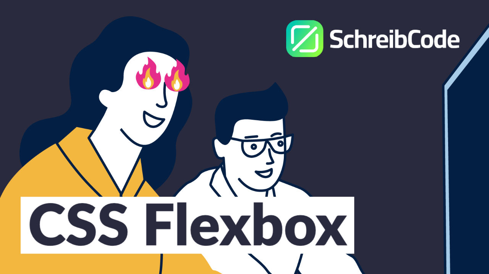

# CSS Flexbox

- In diesem repository findest du den Code zum Video: **Lern Flexbox in 18 Minuten - Mit Übungen**.
- Falls du das Video noch nicht gesehen hast kannst du es hier:
  [Link zum Video](https://www.youtube.com/watch?v=VUCFWWdjl2M) anschauen.

## Wie kriege ich den Code?

- Rechts oben ist ein grüner Button auf dem "Code" steht.
- Drück da drauf und kopiere den HTTPS Link oder den SSH Link (Wenn du nicht weißt was SSH ist nimm den HTTPS Link)
- Öffne die Kommandozeile auf deinem Computer und gib ein: ```git clone <der-kopierte-link>```
- Jetzt wird das repository auf deinen Rechner runtergeladen.

## Es funktioniert nicht / Ich habe kein git

- Option 1: [Installiere git](https://www.atlassian.com/de/git/tutorials/install-git)
- Option 2: Lade dir den Code als ZIP Datei runter. Die Option findest du auch wenn du auf den grünen Button klickst.


